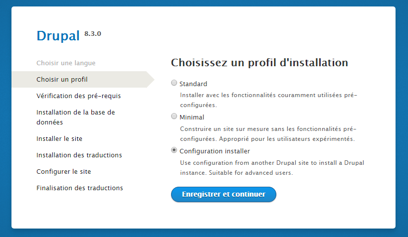

[Retour à l'accueil](../README.md)

# Exporter et importer Drupal 8 - Développer avec Drupal 8

## Indexe

* [Introduction](#introduction)

## Introduction

Exporter et importer Drupal 8, pour un débutant avec Drupal, est extrêmement plus facile à dire qu'à faire! Ne croyez pas que cette aventure est triviale, plusieurs précautions sont à prendre et plusieurs étapes sont à suivre. Heureusement que le web est remplit de documentation et que plusieurs plugins Drupal existent. Si vous croyez que Google va vous aider à maitriser cette étape, je vous souhaite bonne chance! Je vous recommande de maitriser tous les fonctionnements Drupal relatifs à ce sujet si vous comptez vous aventurer seul avec ce sujet.

## Exportation

### Les fichiers à inclure

L'important avant de se lancer dans l'exportation d'un site Drupal pour le migrer sur un autre serveur *(par exemple, de développement à Production)*, c'est de savoir quoi inclure comme fichiers dans ses sauvegardes personnelles. Par exemple, vous pouvez inclure simplement tout les fichiers, mais cela créerait des répertoires très lourds à télécharger et pas nécessairement à jour, se qui vous ferais télécharger le cœur de Drupal pour rien ou des fichiers générés automatiquement... Par conséquent, n'incluez pas inutilement le cœur (`/core`) de Drupal dans vos sauvegardes. De plus, pour les bonnes pratiques, il ne faudrait pas inclure des fichiers comportant des informations sensibles et unique tel que `site/default/settings.php`. N'incluez pas non-plus des fichiers générés automatiquement (CSS, JavaScript ou autres). Pour m'éviter de les télécharger un à la fois, j'inclus le dossiers des modules (`/modules`) dans mon exportations. Un coup importé, je sais qu'ils ne seront peut-être pas tous à jours, mais je préfère prendre ce risque, car Drupal ne fait pas encore les mises à jours automatique de plugins. Alors, voici à quoi ressemble les fichiers que j'inclus dans un repo git:

* documentation/*.md

* modules/*

* themes/*

* profiles/*

* site/default/files/config_XYZ/sync/*

* composer.json, composer.lock, README.md, etc. 

* etc *(etc n'est pas un fichier. mais tout se que vous désirez ajouter.)*

> Je n'inclus pas mes thèmes et modules dans le cœur. Assurez-vous, avant de finaliser votre exportation, qu'aucun fichier important ne traine dans le cœur.

Pour mettre à jour les fichiers situé dans le répertoire `site/default/files/config_XYZ/sync/*`, vous pouvez simplement exécuter la commande Drush suivante:

	
	drush config:export

les fichiers généré sont primordiales pour l'importation de votre site.
	
## Importation

Installer le site en téléchargent la version officiel de Drupal et en y incluant tous les fichiers exporter précédemment.

### Module [Config Installer](https://www.drupal.org/project/config_installer)

Ce "module" n'est pas vraiment un module Drupal *(n'essayez pas de l'importez avec l'interface utilisateurs, ça ne marchera pas xD)* il faut inclure ce complément de Drupal dans le dossier `/profiles` tel que `/profiles/config_installer/`. Du coup, lorsque vous tenterez d'installer votre site, vous verrez un option de plus à l'étape de la sélection d'un profil.

Vous pourrez par la suite inclure les fichiers de configurations du dossier `site/default/files/config_XYZ/sync/*` générés à l'exportation.

